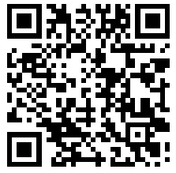
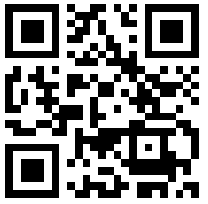

Hello World !  

😄Meu nome é Natalia sou estudante de Analise e desenvolvimento de Sistemas na faculdade Impacta. 
🌱Atualmente estou aprendendo sobre Python e banco de dados 

📫Como entrar em contato comigo:
[Linkedin](https://www.linkedin.com/in/natalia-aparecida-tavares) & [Telegram](https://t.me/Natyy15) & [GitHub](https://www.github.com/NataliaTavares) & <a href="mailto:natalia.tavares15@outlook.com">E-mail</a> 

 
  
 
 

<!--
**NataliaTavares/NataliaTavares** is a ✨ _special_ ✨ repository because its `README.md` (this file) appears on your GitHub profile.

Here are some ideas to get you started:

- 🔭 I’m currently working on ...
- 🌱 I’m currently learning ...
- 👯 I’m looking to collaborate on ...
- 🤔 I’m looking for help with ...
- 💬 Ask me about ...
- 📫 How to reach me: ...
- 😄 Pronouns: ...
- ⚡ Fun fact: ...
-->

